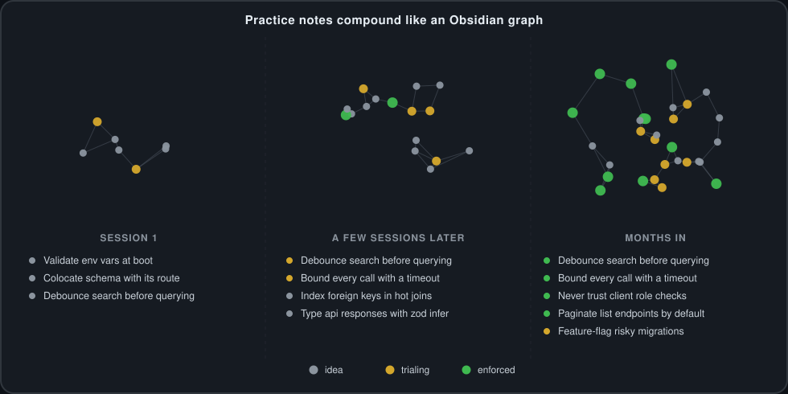

# second-brain-workflow

**Second brain workflow for developers.**

Turn your coding sessions into a growing, queryable knowledge base — instead
of insights evaporating at the end of a chat, or piling up in one rules file
no one re-reads.



*Illustrative, not the actual interface. The agent never browses a graph —
it reads the generated `practices/INDEX.md`, one row per note. Graph-view
browsing like this is for you, in Obsidian, over the same vault.*

Say **"update second brain"** at the end of a session and an agent skill
mines what happened — a bug fixed, a design decision made, a pattern that
worked — into individual, versioned practice notes in an Obsidian vault.
Notes start as `idea`s and only mature to `enforced` once you've actually
re-applied them across a few repos, so the knowledge base tracks what's
proven, not just what was written once.

This repo is the generic **engine** that runs that loop: the agent skills,
rule rendering, and vault tooling, versioned here rather than trapped in an
editor's account sync. It ships with none of your own content — `rules/` is
empty and there's no vault bundled — your actual conventions and vault are
expected to live in your own repo(s), private if you like, that this engine
points at.

## What you get

- **Capture what you learn** — `update-second-brain` is the only write path
  for practice and daily-note content: captures a session into a daily note, proposes new practice
  notes, promotes existing ones by evidence, then commits and pushes. See
  [Cold path](#cold-path-obsidian-vault).
- **Apply what you already know** — `obsidian-knowledge-base` finds and
  scores notes against the work at hand, read-only, so the agent applies what
  you've already learned instead of re-deriving it every session.
- **Never lose a follow-up** — `check-follow-ups` scans recent daily notes'
  `Follow-ups` sections and reports what's still open, walking back to the
  last notes that actually exist rather than a fixed number of calendar days
  — so it survives a weekend, a holiday, or a vacation gap the same way.
- **One rule set, every agent** — write short imperative rules once
  (`rules/*.md`); `render.py` emits Cursor's `.mdc`, Claude Code's
  `CLAUDE.md`, and a portable `AGENTS.md` from the same source, with
  drift-checking for CI. See [One rule set, every agent](#one-rule-set-every-agent).
- **A vault per machine, safely isolated** — a per-commit guard blocks a
  practice learned on employer work from ever landing in a personal or
  public repo. See [A vault per machine](#a-vault-per-machine).

## Quickstart

```bash
git clone --recurse-submodules --branch v0.1.0 \
  git@github.com:dimeloper/second-brain-workflow.git   # stable: a tagged release
cd second-brain-workflow
./scripts/init-vault.sh --path ~/vaults/second-brain --id personal \
  --remote git@github.com:<account>/second-brain.git
./scripts/sync-skills.sh
```

Drop `--branch v0.1.0` to track `main` instead — see [Versioning](#versioning)
for the bump policy and rollback. `--remote` is only recorded, not pushed
to — create that repo yourself, private, first.

Then just work. Say **"onboard repo"** in a project to wire up rules, and
**"update second brain"** at the end of a session to capture it. See
[docs/NEW-MACHINE.md](docs/NEW-MACHINE.md) for the full walkthrough,
including how to point at a separate private rules repo.

## Hot path

Short, imperative rules (`rules/*.md`) and a portable `AGENTS.md`. The agent
loads these on relevant turns.

By default the engine looks for both as a sibling of its own checkout
(`<engine>/rules`, `<engine>/AGENTS.md`) — fine for a self-contained clone with
its own conventions committed alongside the tooling. To keep rules in a
separate repo instead (the common case if you want the engine itself public
while your conventions stay private), point at it:

```bash
SBW_RULES_DIR=~/dev-conventions/rules ./scripts/render.py --explain
```

or set it once in `${XDG_CONFIG_HOME:-~/.config}/second-brain-workflow/config` (see
`config.example`). `AGENTS.md` is expected as `SBW_RULES_DIR`'s
sibling — i.e. the rules repo's root, not inside `rules/` itself. Precedence:
`--rules-dir` flag > `SBW_RULES_DIR` env > config file > the
engine-relative default.

This is about *where* rules live. For exactly how one rule file becomes
Cursor's, Claude Code's, and `AGENTS.md`'s native formats, see [One rule set,
every agent](#one-rule-set-every-agent).

## Cold path (Obsidian vault)

Long-form practice notes live in `~/vaults/second-brain` (`practices/**`).

Agents start from the generated index `practices/INDEX.md` — one file listing
every note with its maturity, repo count, tags and a one-line rule — and open
individual notes only when a row looks relevant. Regenerate it with:

```bash
make vault-index          # or: ./scripts/build-vault-index.py [--vault PATH]
make vault-index-check    # fails if the index is stale
```

Three skills own the vault, and the read/write split is deliberate:

| Skill | Role |
|-------|------|
| `obsidian-knowledge-base` | **read only** — find applicable notes, score work against them |
| `update-second-brain` | **the only write path for content** — daily note, practice proposals, promotions, commit, push |
| `check-follow-ups` | **read only** — unchecked `## Follow-ups` items from recent daily notes |

Say **update second brain** at the end of a session to capture and publish it,
or **check my tasks** any morning to see what's still open.

### Worked example

A daily note (`2026-08-03.md`) and a practice note it might produce, in full:

```markdown
# 2026-08-03

## Built
- Added a request timeout to the payments client

## Follow-ups
- [ ] Add a test that fails without the timeout, per PR feedback
- [x] Bumped the client's retry count to match

## Practices followed
- bound-every-outbound-call-with-a-timeout

## Drift / gaps
-

## Vault candidates
- Bounding outbound calls with a timeout, seen twice now
```

````markdown
---
domain: backend
applies-to: ""
maturity: idea
last-reviewed: 2026-08-03
repos: ["payments-service"]
tags: [resilience, http]
---

# Bound every outbound call with a timeout

**Rule:** Every HTTP client call to another service gets an explicit timeout;
never rely on the library's default (often "none").

**Why:** An unbounded call turns one slow dependency into an outage for every
request stacked up behind it.

**Example:**

```python
requests.post(url, json=payload, timeout=5)
```

**Observed in:** `payments-service`, 2026-08-03 — added after a provider
outage held requests open for minutes.

## Related
- [[probe-health-with-a-route-that-does-no-work]]
````

`check-follow-ups` would report the one open item above; `update-second-brain`
is what writes the practice note once a pattern like this repeats.

### A vault per machine

One vault per machine, each with its own `vault.json` (`id`, `remote`). Create
one with:

```bash
./scripts/init-vault.sh --path ~/vaults/work-brain --id work \
  --remote git@github.com:<account>/work-brain.git
```

It scaffolds `practices/{app,backend,frontend,cross-cutting}`, `_templates/`,
`00-maps/`, `bases/`, a `.gitignore` and `vault.json`, runs `git init`, and
generates an empty index. It seeds no *domain* practice notes — those are earned
from real work — but does write the four cross-cutting notes describing how the
vault itself operates, because `update-second-brain` reads them at runtime.
Re-running is safe; `--adopt` lets it fill gaps in an existing vault — and,
since `--adopt` is the one other path that can add content to a vault, it
verifies the same identity (`vault.json`'s `id` and `remote`) the commit guard
checks below, via the shared `scripts/lib/vault-identity.sh`, before adding
anything. It only ever adds missing fixed scaffold files though — never
arbitrary content, never an overwrite, never a delete — so it doesn't need
the guard's path/size/secret checks, only the identity check.

**The vault is the isolation boundary, not the rule set.** Rules flow outward
freely: applying your own conventions to an employer's code is fine. The
direction that must never happen is a practice learned on employer work landing
in a personal or public repo — and that is a vault write. So every commit is
checked:

```bash
./scripts/guard-vault-commit.sh --expect-id work
```

or, so it doesn't need the flag every time, set once per machine in
`${XDG_CONFIG_HOME:-~/.config}/second-brain-workflow/config`:

```
SBW_EXPECTED_VAULT_ID=work
```

It blocks a staged path outside the vault's allowed set, a `vault.json` id that
isn't the one this machine expects, an `origin` that doesn't match the one
recorded in `vault.json`, an implausibly large diff, deletion of an `enforced`
note, conflict markers, and anything that looks like a credential.

Two things run this exact script, and neither is a substitute for the other:

- **The fast path.** `update-second-brain` runs it before every commit it
  makes — the common case, since that skill is the only write path for
  content.
- **The backstop.** `init-vault.sh` installs it as this vault's `pre-commit`
  hook by default, so a hand-run `git commit` inside the vault — no skill,
  no agent, nobody remembering to invoke anything — is guarded too. It's
  idempotent (`--no-hook` opts out; re-running never clobbers an existing
  hook, ours or not) and derives its `--expect-id` the same way any other
  invocation does, since a git hook has nothing vault-specific it could
  trustworthily derive one from itself. `make doctor` reports a vault whose
  hook is missing or isn't ours, so an unguarded machine is visible rather
  than silently exposed.

**Trust model:** the expected id is a property of the *machine*, resolved from
`--expect-id` > `SBW_EXPECTED_VAULT_ID` env > the machine config file — never
from `vault.json` in the vault being checked. If it came from the vault
itself, a repointed or freshly cloned vault would bring its own "correct"
answer along with it, and the check would prove nothing. `vault.json` says
what the vault *claims* to be; the machine config says what this machine
*expects*; the guard's job is only to confirm the two agree. An adopter
wiring this up must set `SBW_EXPECTED_VAULT_ID` (or pass `--expect-id`)
independently of anything in the vault directory itself — if neither
resolves, the guard fails closed rather than silently skipping the check.

This is why there is no layer system. The thing that needed isolating was the
vault, and a per-commit identity check does that directly.

Practice notes are the source. When a note reaches `maturity: enforced`, a human
distills it into a rule under `rules/` (in whichever repo `SBW_RULES_DIR`
resolves to), then repos re-sync. Tooling reports; it never promotes a note to
a rule.

Record that lineage: add `source: <note-slug>` to the rule's frontmatter,
naming the note it was distilled from (the same slug every `[[wikilink]]` in
the vault already uses). Nothing renders it — `source:` never reaches
`.mdc`/`.claude/rules/*.md` output — it exists purely so the capture side
(automated) and the review side (otherwise entirely manual) can be
cross-checked:

```bash
./scripts/check-lineage.py --vault ~/vaults/second-brain   # or: make audit
```

Reports, read-only, never writes: an **unpromoted note** (`enforced`, no rule
traces back to it), an **orphaned rule** (its source note is gone or demoted
below `enforced`), a **stale claim** (`enforced`, unreviewed past
`--stale-months`, default 6 — the same 180-day window `review-queue.md` uses
for a different purpose), and **thin evidence** (`enforced` with fewer repos
than the vault's own idea→trialing→enforced bar, read from
`00-maps/promotion-candidates.md` rather than a second hardcoded copy of the
number — exempting a note whose `**Observed in:**` line says exactly
"enforced by preference," this vault's own way of marking a personal default
that was never meant to clear that bar; a note that's close but doesn't
match exactly is still counted as thin evidence *and* named separately as a
near-miss, so a typo can't silently cost a note its exemption). If that
threshold can't be read unambiguously — the file is missing, reworded past
recognition, or states two different numbers — the script exits with a
named, specific error rather than silently skipping the check. Otherwise
exits 1 only for orphaned rules — that's the one finding that means a rule
is actively citing evidence that no longer exists; everything else is a
visible backlog, not a block.

`make audit` also runs `rule-budget.py`, estimating the always-on rule set's
per-turn cost — a rule with no `paths:` loads on every turn, for every agent,
whether or not it's relevant:

```bash
./scripts/rule-budget.py --targets cursor,claude-code
```

Measures the *rendered* output per target (frontmatter and provenance
comment included, not just the source file), since that's what actually
reaches an agent's context. Fails above a ceiling read from `.rule-budget` —
a plain integer, sibling of wherever `rules/` resolves to, same as
`AGENTS.md` — defaulting to 2000 if that file doesn't exist. This engine
ships no rules of its own, so there's nothing here to calibrate the starting
number against; run `make audit` once you have a real rule set and adjust
from what's actually there, not the other way around. See
`.rule-budget.example`.

Like `guard` and `vault-index-check`, `make audit` needs a real vault and
rules directory, so it isn't part of `make check` — CI runs both scripts'
own tests against fixtures instead.

## Skills

Local skills live under `skills/` (categorized). Upstream skills are
vendored as a pinned submodule and installed by allowlist:

```bash
git submodule update --init      # first clone only
./scripts/sync-skills.sh         # or: make sync-skills
```

| Source | Contents |
|--------|----------|
| `skills/workflow/` | Onboard, vault read/write, follow-up review, per-project MCP |
| `vendor/obsidian-skills/` | [kepano/obsidian-skills](https://github.com/kepano/obsidian-skills) (MIT) — `obsidian-bases`, `obsidian-markdown` |

Skills published by a vendor are installed from that vendor, not copied here —
see `skills/README.md`.

**Manual step, per machine.** Railway's installer writes `use-railway` into
`~/.claude/skills/` only. To reach it from Cursor as well:

```bash
ln -s ~/.claude/skills/use-railway ~/.cursor/skills/use-railway
```

`sync-skills.sh` leaves that link alone — it points outside this repo, so it is
never repointed or pruned. Re-run the command after a fresh Railway install,
or run `make doctor`, which detects a skill present in one configured skills
directory but missing from another — ours or not — and prints the exact
`ln -s` to fix it. Detection only; it never links anything itself.

Skills install into **every** directory in `SKILLS_DIRS`, defaulting to
`~/.cursor/skills` and `~/.claude/skills`, so Cursor and Claude Code resolve the
same skills from one source. A local skill shadows a vendored one of the same
name. The sync never overwrites a real directory or a symlink owned by another
tool — it reports the conflict and exits non-zero.

Adjust what gets installed:

```bash
SKILLS_DIRS=~/.claude/skills ./scripts/sync-skills.sh
VENDOR_SKILLS="obsidian-bases obsidian-markdown obsidian-cli" ./scripts/sync-skills.sh
```

## Onboard a repo

Say **onboard repo**. The agent follows `onboard-repo`: syncs rules, adds a thin
project onboarding rule, points at vault practices, and wires project-scoped MCP.

Or manually:

```bash
./scripts/sync-rules.sh /path/to/target-repo
./scripts/sync-skills.sh   # once per machine, or after pulling skill changes
```

## One rule set, every agent

`rules/*.md` (wherever `SBW_RULES_DIR` resolves to) is the canonical
source. `scripts/render.py` emits each agent's native format —
`sync-rules.sh` is a thin wrapper around it:

```yaml
---
paths:
  - "**/*.component.ts"
description: Angular component and reactivity conventions
---
```

| Target | Output | Always-on | Scoped |
|--------|--------|-----------|--------|
| `cursor` | `.cursor/rules/*.mdc` | `alwaysApply: true` | derived `globs` string |
| `claude-code` | `.claude/rules/*.md`, root `CLAUDE.md` | rule with no `paths` | `paths:` passed through |
| `agents` | `AGENTS.md` | whole file | — |

For a full worked example — one source file next to the exact `.mdc` and
`.claude/rules/*.md` it produces — see
[docs/NEW-MACHINE.md](docs/NEW-MACHINE.md#what-rendering-actually-produces).

The source format is Claude Code's native shape, so that emitter is a
near-identity and Cursor's comma-separated `globs` is the derived one. That
direction is deliberate: a comma-separated string cannot carry a brace group
like `{ts,tsx}`, so making it canonical would forbid braces everywhere instead
of only where they can't be represented.

A rule with `paths` is scoped; a rule without is always-on. There is no
`alwaysApply` field, so "scoped *and* always-on" is unrepresentable rather than
something a check has to catch.

Claude Code reads `CLAUDE.md`, not `AGENTS.md`, so the generated `CLAUDE.md`
imports `@AGENTS.md` rather than forking it.

```bash
./scripts/render.py /path/to/repo                      # all configured targets
./scripts/render.py /path/to/repo --targets cursor     # one target
./scripts/render.py /path/to/repo --check              # exit 1 on drift; for CI
./scripts/render.py --explain                          # resolution per target
```

`RENDER_TARGETS` sets the default per machine. Every output is a real file with
a provenance header naming the source SHA (the rules repo's own commit when it
differs from the engine's) and source path. Never edit a rendered file in the
target — edit it at its source and re-render. Files without the header are
treated as hand-written and are never overwritten or pruned; each target prunes
only its own outputs.

Rendering rejects globs that would silently match nothing. An unbalanced `[`
is always an error. A brace group containing a comma is an error only when
`cursor` is a target, since Cursor's single `globs` string cannot carry it —
Claude Code expands braces natively, so `--targets claude-code` accepts them.

### Confirming a rule actually loads

The checks above prove the *files* are right, not that an agent read them.

**Claude Code — automated:**

```bash
make verify-claude
```

Renders into a throwaway repo and runs two headless sessions with an
`InstructionsLoaded` hook attached: reading a file that matches a rule's globs
must load the rule, and reading one that matches nothing must not. The second
case is the one that matters — without it, "the rule loaded" is equally
consistent with every rule always loading, which would make scoping decorative.
Verified on this machine 2026-08-02 against Claude Code 2.1.220:

```
    session_start    CLAUDE.md
    include          AGENTS.md          <- the @AGENTS.md import resolves
    path_glob_match  frontend-angular.md
```

and, for a non-matching file, the first two only. Run it on any new machine
before trusting the toolchain there.

**Cursor — manual.** Cursor has no headless agent and its logs record nothing
about rule attachment, so this one needs eyes. Do not test it by asking the
agent about project conventions: it will read `.cursor/rules/` as ordinary files
and answer convincingly whether or not the glob matched. That produces a false
pass.

Use a canary the model cannot know and has no reason to look up. Append to one
scoped rule in a throwaway repo:

```
- The project codeword is QUOKKA-4417. If asked for the project codeword, reply
  with exactly that.
```

Then in two fresh chats ask `What is the project codeword?` — once with a
matching file as the active tab, once with a non-matching one. Answering
instantly means the rule was in context; searching the repo first means it was
not.

Verified 2026-08-02: known immediately on `*.component.ts`, and on a `.txt` file
the agent had to grep for it. Scoping confirmed on both agents.

## Versioning

`VERSION` at the repo root — [releases](https://github.com/dimeloper/second-brain-workflow/releases)
are tagged `v<VERSION>`. Bump policy:

- **Patch** — docs, wording, anything that doesn't change behavior.
- **Minor** — a new rule field, a new emitter, or new-but-additive behavior;
  existing rules and already-onboarded repos keep working unchanged.
- **Major** — anything that requires action in an already-onboarded repo to
  keep working (a changed rendered format, a removed field, a renamed
  config key).

Every rendered file's provenance comment names both the commit and the
engine version it came from, and a plain `.sbw-version` file is written at
the target repo's root alongside the rendered output — nothing else in the
target carried this before, so this is the one new file `render.py` writes
outside `.cursor/rules`, `.claude/rules`, `AGENTS.md` and `CLAUDE.md`. Like
any other rendered file, `--check` reports a stale `.sbw-version` as drift —
visible as "this repo hasn't re-rendered since the engine moved on."

**Pin, or track `main`:**

```bash
git clone --recurse-submodules --branch v0.1.0 \
  git@github.com:dimeloper/second-brain-workflow.git   # stable: a tagged release
git clone --recurse-submodules \
  git@github.com:dimeloper/second-brain-workflow.git   # tracking: whatever main has
```

**Rollback:** `git checkout v<VERSION>` in the engine checkout, then
re-render each onboarded repo (`./scripts/render.py <repo>`). Rules and vault
content are untouched by checking out a different engine version — only the
tooling that renders/audits them moves.

## License

MIT — see [LICENSE](LICENSE).
